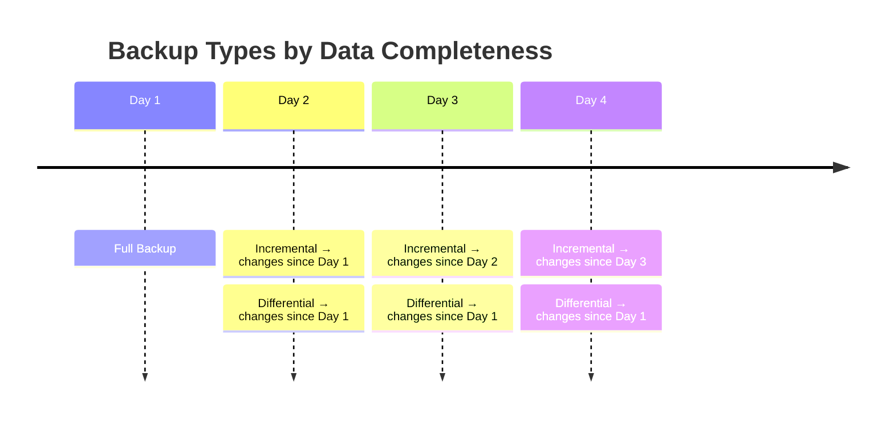
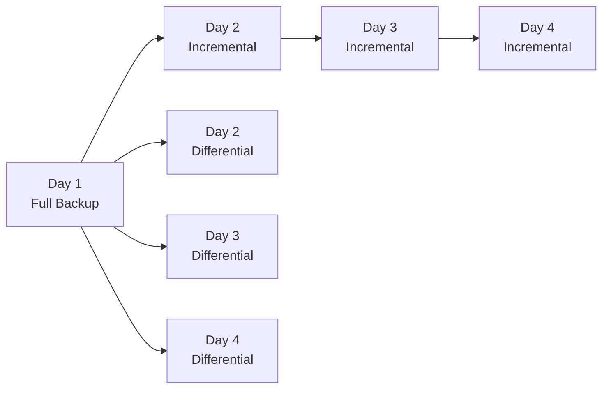
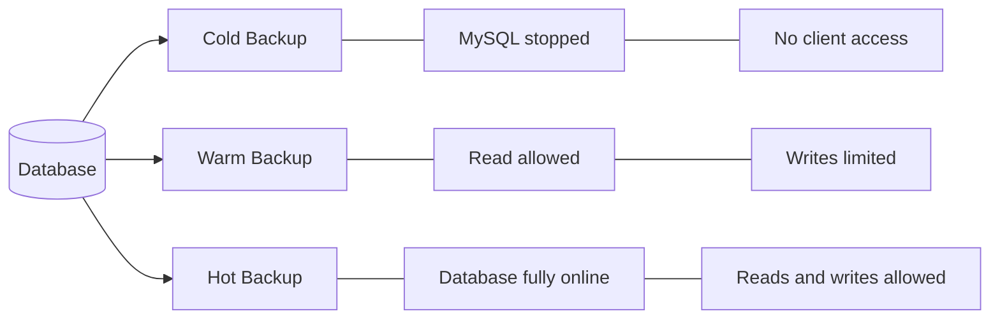
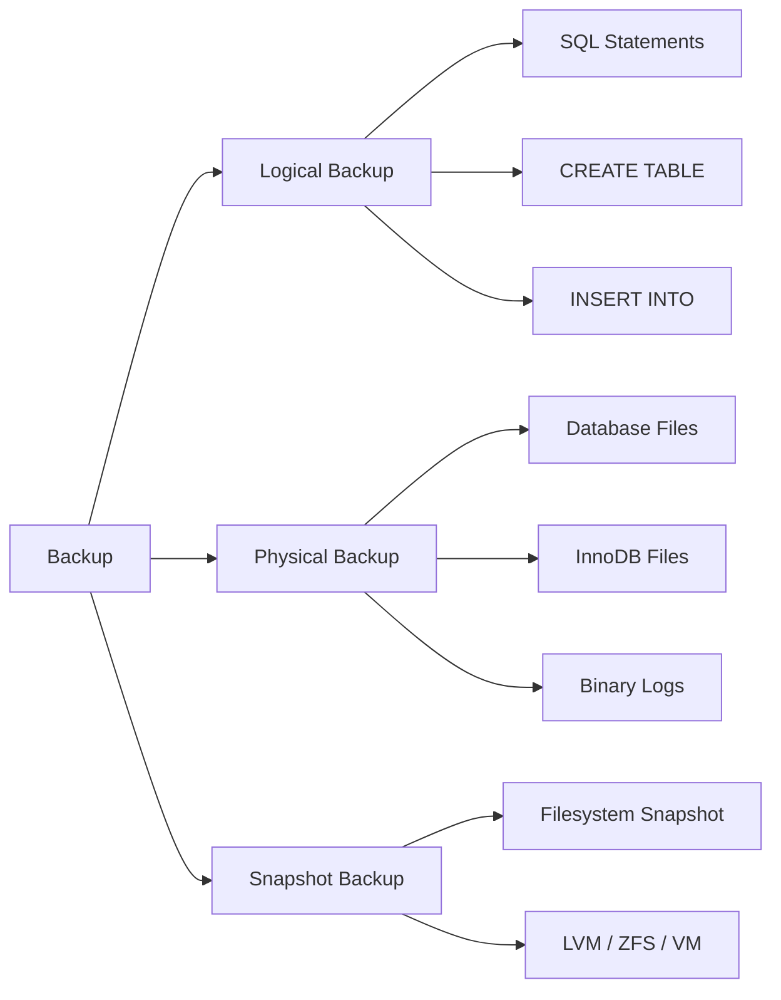
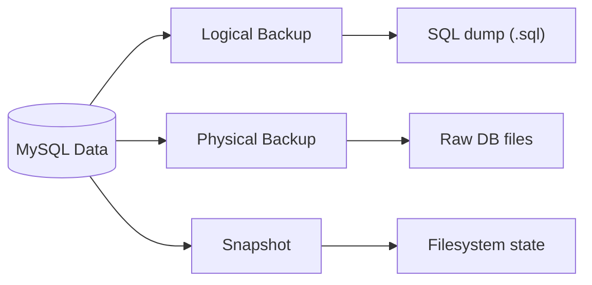

# Резервні копії (Backup) у MySQL — докладна довідка

## Що таке резервна копія БД
Резервна копія (backup) — це копія даних бази даних, яка створюється для:
- відновлення після збою
- захисту від втрати даних
- перенесення БД
- відновлення після помилок користувача
- disaster recovery

## Навіщо потрібні backup-и
📌 Основні причини
| Причина             | Приклад                        |
| ------------------- | ------------------------------ |
| Випадкове видалення | `DELETE FROM users;` без WHERE |
| Збій диска          | пошкодження SSD/HDD            |
| Злам сервера        | ransomware                     |
| Помилка оновлення   | upgrade зламав БД              |
| Міграція            | перенос на інший сервер        |


## Основні вимоги до backup
✔️ цілісність даних  
✔️ можливість відновлення  
✔️ мінімальний downtime  
✔️ автоматизація  
✔️ регулярність  

## Класифікація backup-ів


### 1. За повнотою даних




#### 1.1. Full Backup (повний backup)
📌 Що це  
Повна копія всієї БД.

✔️ Містить
- всі таблиці
- всі дані
- індекси
- структуру

✔️ Переваги
- просте відновлення
- незалежний backup

❌ Недоліки
- великий розмір
- довше створення

🧠 Приклад
```bash
mysqldump -u root -p --all-databases > full.sql
```

#### 1.2. Incremental Backup (інкрементальний)
📌 Що це  
Містить лише зміни:
- після останнього backup

🧠 Приклад
```
Day1 → full
Day2 → changes since Day1
Day3 → changes since Day2
```

Restore


✔️ Переваги
- маленький розмір
- швидке створення

❌ Недоліки
- складніше відновлення
- потрібен весь ланцюг backup-ів

📌 Часто використовує:
- binlog
- XtraBackup

#### 1.3. Differential Backup (диференційний)
📌 Що це  
Містить зміни:
- після останнього FULL backup


🧠 Приклад
```
Day1 → full
Day2 → changes since Day1
Day3 → changes since Day1
```

✔️ Переваги
- простіше відновлення ніж incremental

❌ Недоліки
- більший розмір

#### Порівняння
| Тип          | Розмір    | Відновлення |
| ------------ | --------- | ----------- |
| Full         | великий   | просте      |
| Incremental  | маленький | складне     |
| Differential | середній  | середнє     |





### 2. За ступенем впливу на БД



#### 2.1. Cold Backup (холодний)
📌 Що це  
Backup при повністю зупиненій БД.

🧠 Процес
```bash
systemctl stop mysqld
cp -r /var/lib/mysql /backup
```

✔️ Переваги
- консистентність
- простота

❌ Недоліки
- downtime

#### 2.2. Hot Backup (гарячий)
📌 Що це  
Backup без зупинки MySQL.

✔️ Переваги
- без downtime
- production-friendly

❌ Недоліки
- складніший

📌 Інструменти
- Percona XtraBackup
- MySQL Enterprise Backup

#### 2.3. Warm Backup (теплий)
📌 Що це  
БД працює, але:
- write operations обмежені


🧠 Наприклад
```sql
FLUSH TABLES WITH READ LOCK;
```

### 3. За способом створення

ЩО саме копіюється

#### 3.1. Logical Backup (логічний)
📌 Що це  
Backup у вигляді SQL-команд.

🧠 Приклад
```sql
CREATE TABLE ...
INSERT INTO ...
```

✔️ Переваги
- переносимість
- читабельність

❌ Недоліки
- повільніше
- великий розмір

📌 Інструменти
- `mysqldump`

#### 3.2. Physical Backup (фізичний)
📌 Що це  
Копіювання реальних файлів БД.

✔️ Переваги
- дуже швидко
- підходить для великих БД

❌ Недоліки
- залежність від версії/OS

📌 Інструменти
- XtraBackup
- mysqlbackup

#### 3.3. Snapshot Backup
📌 Що це  
Моментальний знімок файлової системи.

📌 Приклади
- LVM snapshot
- ZFS snapshot
- VMware snapshot

✔️ Переваги
- дуже швидко

❌ Недоліки
- залежить від storage system

#### Дуже наочне порівняння



## Основні методи backup у MySQL

### 1. mysqldump
📌 Що це  
Стандартна утиліта MySQL:
- створює logical backup

🔹 Як працює  
👉 генерує SQL:
```sql
CREATE TABLEINSERT INTO
```

🔹 Full backup
```bash
mysqldump -u root -p --all-databases > full.sql
```

🔹 Backup однієї БД
```bash
mysqldump -u root -p mydb > mydb.sql
```
🔹 Backup таблиці
```bash
mysqldump -u root -p mydb users > users.sql
```

🔹 Consistent backup
```bash
mysqldump --single-transaction
```

📌 Для чого  
👉 InnoDB hot logical backup.

🔹 Відновлення
```bash
mysql -u root -p mydb < mydb.sql
```

✔️ Переваги
 - простий  
 - portable  
 - читається як текст  

❌ Недоліки
 - повільний  
 - великі файли  
 - велике навантаження  

### 2. mysqlpump
📌 Покращена версія mysqldump  
✔️ parallel dump  
✔️ швидший  

### 3. MySQL Enterprise Backup (mysqlbackup)
📌 Що це  
Офіційний enterprise backup tool.

✔️ Підтримує
- hot backup
- incremental
- compression

❌ Мінус
- enterprise/commercial.

### 4. Percona XtraBackup
📌 Що це  
Percona XtraBackup — найпопулярніший open-source hot backup tool.

🔹 Особливості
✔️ hot backup  
✔️ фізичний backup  
✔️ incremental  
✔️ InnoDB support  

🔹 Встановлення  
🟥 RHEL
```bash
dnf install percona-xtrabackup-80
```

🔹 Створення backup
```bash
xtrabackup --backup --target-dir=/backup/full
```

🔹 Prepare phase  
⚠️ Дуже важливо
```bash
xtrabackup --prepare --target-dir=/backup/full
```

📌 Що робить
- застосовує redo log.

🔹 Restore
```bash
systemctl stop mysqld
```
```bash
xtrabackup --copy-back --target-dir=/backup/full
```


🔹 Права
```bash
chown -R mysql:mysql /var/lib/mysql
```

✔️ Переваги  
 - production-ready  
 - дуже швидкий
 - без downtime

❌ Недоліки
 - складніший
 - тільки фізичний backup

## Binary Logs (binlog)
📌 Що це  
Журнал всіх змін БД.

🔹 Навіщо  
✔️ point-in-time recovery  
✔️ replication  
✔️ incremental backup  

🔹 Увімкнення
```ini
log_bin = mysql-bin
```

🔹 Відновлення до конкретного моменту
```bash
mysqlbinlog mysql-bin.000001 | mysql -u root -p
```

## Стратегія backup (Best Practice)

📌 Типова схема
| Backup      | Частота        |
| ----------- | -------------- |
| Full        | раз на тиждень |
| Incremental | щодня          |
| Binlog      | постійно       |


🔹 3-2-1 Rule  
✔️ 3 копії  
✔️ 2 різних носії  
✔️ 1 копія offsite  

🔹 Що треба backup-ити крім БД  
✔️ my.cnf  
✔️ binlog  
✔️ users/grants  
✔️ scripts  

🔹 Перевірка backup-ів ⚠️  
👉 backup без restore test = ненадійний backup.

## Часті помилки
| Помилка            | Причина                |
| ------------------ | ---------------------- |
| backup пошкоджений | не тестували restore   |
| inconsistent dump  | MyISAM + active writes |
| forgot binlogs     | немає PITR             |
| full backup only   | довге відновлення      |


## Висновок
👉 Існують різні класифікації backup-ів:
| Критерій | Типи                              |
| -------- | --------------------------------- |
| Повнота  | full / incremental / differential |
| Downtime | cold / warm / hot                 |
| Метод    | logical / physical / snapshot     |


🔥 Найважливіше  
👉 Для маленьких БД:
- mysqldump

👉 Для production:
- XtraBackup + binlog

👉 Backup = це не копія файлів  
👉 Backup = можливість відновлення даних  